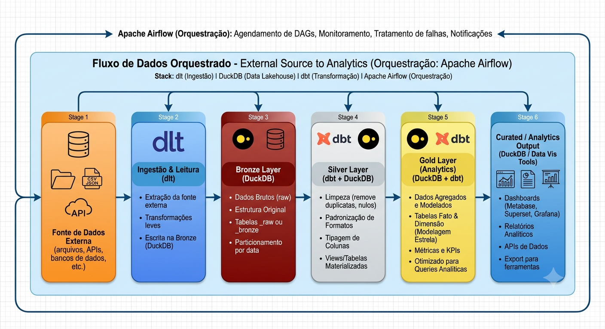

# 📊 Pipeline de Dados: Contoso Analytics

## 📝 Sobre o Projeto

Este projeto prático de Engenharia de Dados foi desenvolvido no âmbito dos estudos da Brain Data, um hub estratégico voltado para a formação e evolução de profissionais da área. A iniciativa consiste na implementação de um pipeline end-to-end totalmente local, projetado para extrair, processar e modelar a base de dados da Contoso, disponibilizada pela Microsoft. O objetivo central é demonstrar o ciclo de vida completo do dado, desde a sua captura inicial até a disponibilização em uma camada analítica estruturada para a geração de insights estratégicos e construção de dashboards, utilizando ferramentas modernas e as melhores práticas do mercado.

Embora a fonte primária do projeto seja um arquivo estático em formato Parquet contendo cerca de dez milhões de linhas, a arquitetura foi intencionalmente desenhada para simular o comportamento de um ambiente de produção real com crescimento orgânico e contínuo dos dados. Por esse motivo, foram incorporadas ferramentas avançadas de ingestão, tratamento, modelagem e orquestração. Essa abordagem permite exercitar padrões de escalabilidade e engenharia de software que vão além das necessidades de uma carga estática simples, enriquecendo o aprendizado prático.

A Contoso é uma empresa fictícia de varejo criada pela Microsoft para servir como ambiente padrão de demonstração e testes em arquiteturas de dados e inteligência de negócios. A sua base representa um cenário empresarial complexo, englobando transações de vendas, gestão de estoque, cadastro de clientes, catálogo de produtos e estrutura de lojas físicas e online. Essa riqueza de informações e relacionamentos torna a Contoso o modelo ideal para simular desafios reais do mercado, exigindo uma modelagem dimensional rigorosa para transformar um grande volume de dados brutos em inteligência acionável para o negócio.

## 🏗️ Arquitetura e Etapas do Pipeline
O fluxo de dados foi desenhado focando em eficiência, qualidade de dados e escalabilidade local através da **Arquitetura Medallion** (Bronze, Silver e Gold).



### 📋 Mapeamento de Execução do Pipeline

| Etapa | Estágio / Camada | Descrição do Processo | Ferramenta / Tech | Status / Progresso |
| :---: | :--- | :--- | :---: | :---: |
| **01** | **Fonte de Dados Externa** | Leitura de arquivo estático Parquet (base Contoso com ~10 milhões de linhas). | Arquivo Parquet | `[██████████]` 100% |
| **02** | **Ingestão e Leitura (dlt)** | Ingestão via script Python com `dlt`, validação de dados e inferência de schema. | Python / dlt | `[░░░░░░░░░░]` 0% |
| **03** | **Camada Bronze (Raw)** | Criação/Carga como *external table* no DuckDB, mantendo a estrutura bruta dos dados. | DuckDB | `[░░░░░░░░░░]` 0% |
| **04** | **Camada Silver (Cleaned)** | Limpeza, padronização, tipagem de dados, deduplicação e testes de Data Quality com `dbt`. | dbt + DuckDB | `[░░░░░░░░░░]` 0% |
| **05** | **Camada Gold (Analytics)** | Modelagem dimensional (Fato/Dimensão), criação de agregados, métricas e KPIs do negócio. | dbt + DuckDB | `[░░░░░░░░░░]` 0% |
| **06** | **Orquestração** | Agendamento, monitoramento e automação de todo o fluxo através de DAGs. | Apache Airflow | `[░░░░░░░░░░]` 0% |
| **07** | **Curated / Analytics** | Disponibilização das tabelas finais modeladas para relatórios, dashboards e BI. | BI / Analytics | `[░░░░░░░░░░]` 0% |

---

## 🛠️ Stack Tecnológica (Modern Data Stack)
*   **Linguagem:** Python, SQL
*   **Ingestão de Dados:** `dlt` (data load tool)
*   **Orquestração:** Apache Airflow
*   **Data Warehouse / Engine:** DuckDB
*   **Transformação e Modelagem:** `dbt` (data build tool)

## 🏛️ Detalhamento da Arquitetura Medallion (dbt + DuckDB)
*   🥉 **Camada Bronze (Raw Data):** Dados brutos diretamente do `dlt`. Mantém histórico e esquema descoberto automaticamente.
*   🥈 **Camada Silver (Cleaned Data):** Modelo de dados padronizado, limpo, tipado e deduplicado com testes de qualidade aplicados.
*   🥇 **Camada Gold (Curated / Analytics):** Tabelas agregadas, Fato e Dimensões contendo as regras de negócio e métricas.

## 🚀 Benefícios e Destaques do Projeto
*   **Arquitetura *Serverless-feel*:** Design totalmente local, ágil e de baixo custo operacional.
*   **Qualidade e Confiabilidade:** Testes de Data Quality (DQ) e documentação integrados ativamente via `dbt`.
*   **Eficiência:** Processamento rápido de dados estruturados e semiestruturados com DuckDB.
*   **Automação:** Pipeline escalável com orquestração confiável no Airflow e manutenibilidade simplificada.

## 💻 Pré-requisitos
Para rodar este projeto, você precisará ter instalado na sua máquina:
*   [Python 3.9+](https://www.python.org/)
*   [Git](https://git-scm.com/)
*   [Apache Airflow](https://airflow.apache.org/)

## ⚙️ Como Executar
1. Clone o repositório:
   ```bash
   git clone https://github.com/marcelofiquene/contoso-analytics-engineering
   cd contoso-analytics-engineering
   ```

2. Instale as dependências:
   ```bash
   pip install -r requirements.txt
   ```

3. Configure as variáveis de ambiente.
 
4. Inicie o Apache Airflow:
   ```bash
   airflow standalone
   ```

5. Acesse o Airflow (padrão: `http://localhost:8080`), ative a DAG do projeto e acompanhe a execução!

---
*Desenvolvido por [Marcelo Fiquene](linkedin.com/in/marcelofiquene)*
